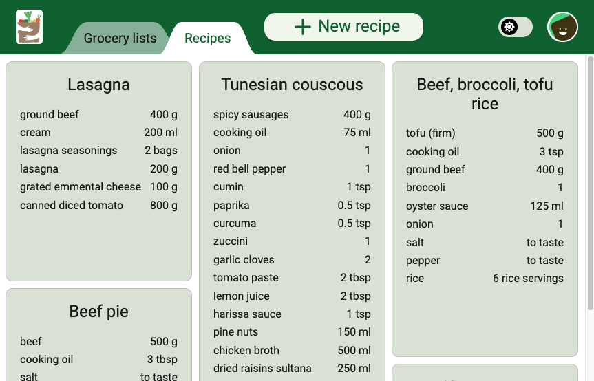

# Welcome to my first full-stack web app

After completing a [Full-Stack Software Engineer](https://www.codecademy.com/learn/paths/full-stack-engineer-career-path) course in November 2022, I started this portfolio project. 

This web app lets users create their account, save recipes, then easily create grocery lists by selecting some of their recipes. 
- Repeating ingredients are combined.
- Ingredients are grouped by section.
- Completed items get push to the bottom.
- Ingredients can be reordered by drag and drop.
- Recipes and lists can be dragged and reordered.
- The app fetches kCal from the USDA API.

[mygrocerylists.netlify.app](https://mygrocerylists.netlify.app/) <-- Try the demo account!

The React frontend is hosted on [another GitHub repo](https://github.com/LongWyrsch/Grocery-list_frontend)

